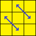
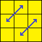

# 3x3 
## Noms :
* Gauche a droite 
  * L ↓
  * M ↓
  * R ↑
* Haut en bas
  * U ←
  * pas de nom 
  * D →
* Face a profondeur
 * F ↷ ( horraire )
 * pas de nom 
 * B ↶ ( anti horraire ) 
 
## Algs 

### Cross
### F2L
### OLL
### PLL
 #### Edges Perm 
   Z Perm
   * (M2 U') (M2 U') M' (U2 M2 U2) (M' U2)
   * (M2 U') (M2 U') M (U2 M2 U2) (M U2)
   
   Z Perm Inverse
  * R' U' R2 U R U R' U' R U R U' R U' R' U2
